### Репозиторий образовательного приложения по дисциплине Теоретически Основы Теплотехники. 

### Приложение реализовано на движке Unity 5 версии [2022.3.58f1](https://unity.com/ru/releases/editor/whats-new/2022.3.58#installs) 

Программа предназначена для дистанционного и очного обучения студентов по дисциплине "Теоретические основы теплотехники" по теме "Характерные процессы изменения состояния идеальных газов"  

Интерфейс программы разработан таким образом, чтобы приложением было удобно пользоваться как на *сенсерном* экране, так и на *мышкой*. А благодаря кроссплатформенной компиляции Unity, приложение можно собрать на различные **мобильные** и **десктопные** операционные системы.

# Пользовательский интерфейс

С самого начала пользователь попадает на начальное меню, в котором еще не предзагружены сцены задач, а только инициализировано приложение в системе.

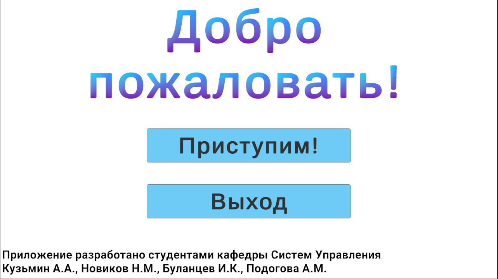


При переходе в главное меню, пользователю доступны задачи для решения и теоретическая справка для решения этих задач.

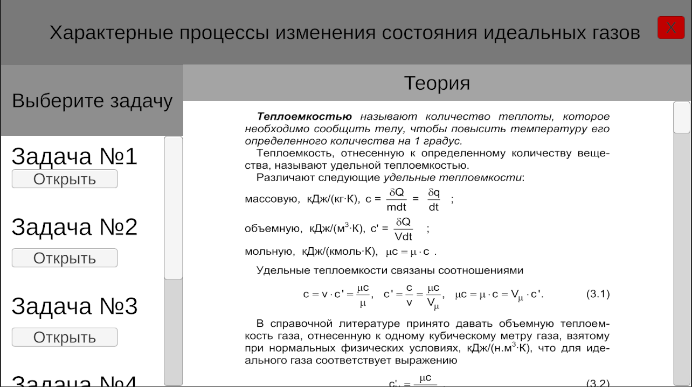


Выбрав задачу, пользователь видит текст задачи.

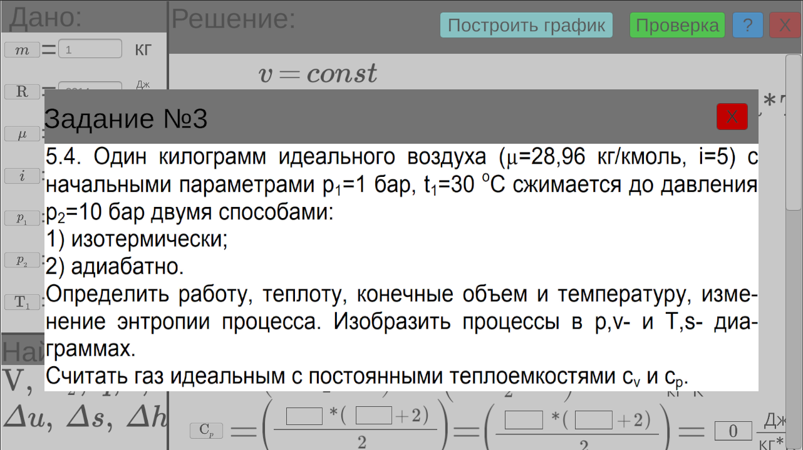


Закрыв окно с текстом задачи, пользователю доступно поле для решения задачи, поле "Дано" и перечень переменных, которых необходимо найти.

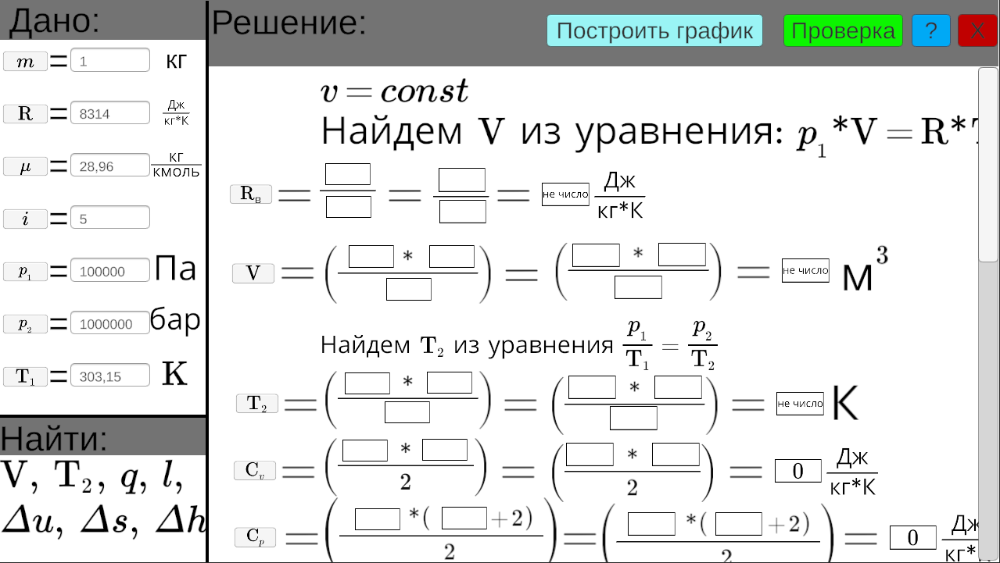


В поле решения задачи пользователю необходимо перетаскивать переменные в определенные места в формулах для нахождения ответа. 

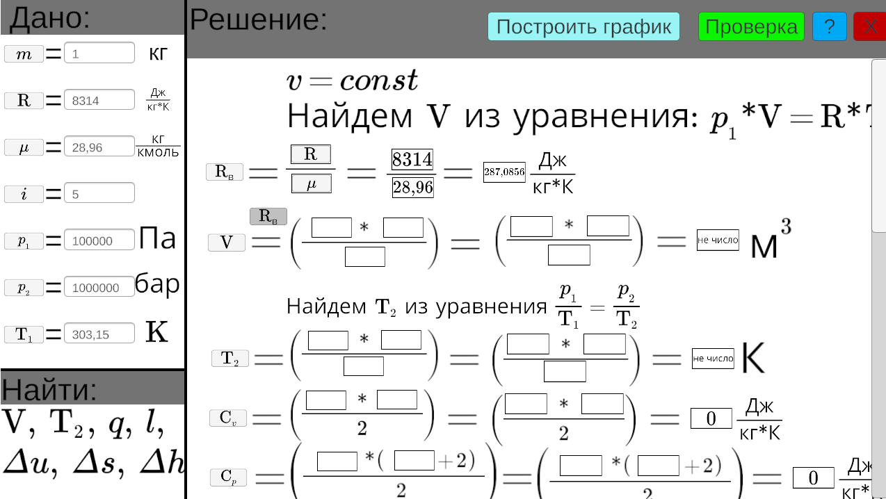


Подставив все необходимые переменные, пользователь может нажать на кнопку "Построить график" в верхнем меню, чтобы отрисовать график зависимости соответсвующих диаграмм. 

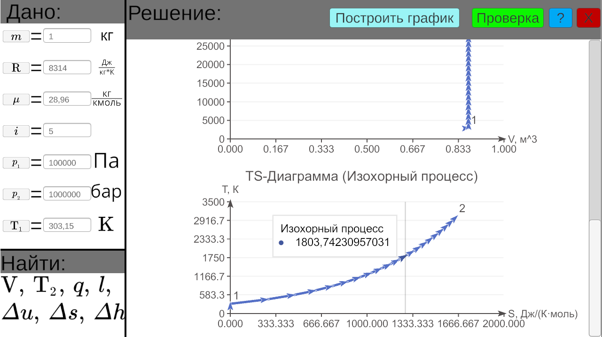


Также, для проверки себя, пользователь может нажать на кнопку "Проверка", чтобы удостовериться, что задача решена верно.
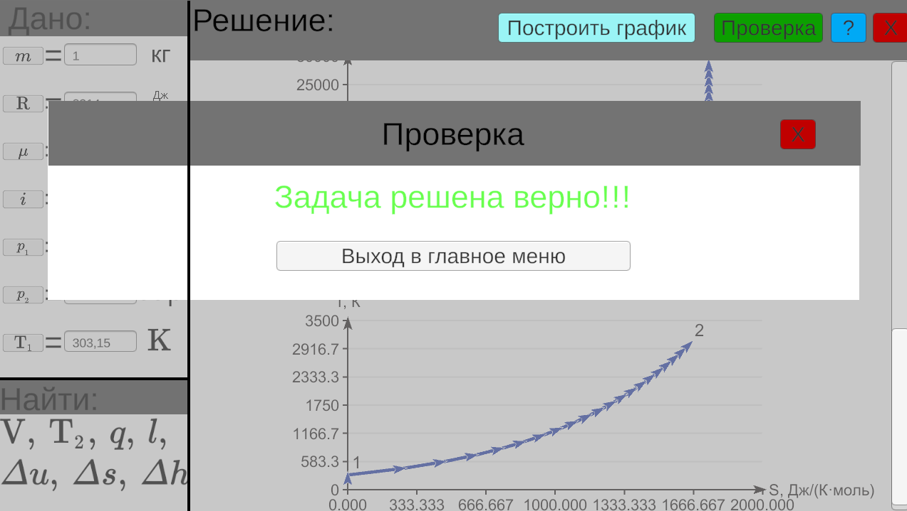

# Разработка новых заданий

## Установка

Необходимо скачать и установить [Unity Hub](https://unity.com/ru/unity-hub), Unity 5 версии [2022.3.58f1](https://unity.com/ru/releases/editor/whats-new/2022.3.58#installs).

Для поддержки дальнейшей разработки рекомендуется сделать fork [этого](https://github.com/kuzk0/TOT2025) репозитория. О том, как сделать форк можно почитать в [github wiki](https://docs.github.com/en/pull-requests/collaborating-with-pull-requests/working-with-forks/fork-a-repo)

После создания форка, [клонируем](https://docs.github.com/en/repositories/creating-and-managing-repositories/cloning-a-repository) ресурсы репозитория к себе на компьютер. 

В Unity Hub добавляем новый проект с локального диска и выбираем директорию, в которую клонировался репозиторий ТОТ2025:
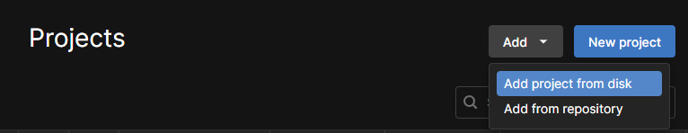

## Настройка окружения

В меню проекта `Project` переходим в папку `Scenes` и с помощью Drag-And-Drop или Ctrl+C-Ctrl+V копируем сцену с номером задачи. Например, `5_4` и переименовываем её в номер **вашей** задачи:
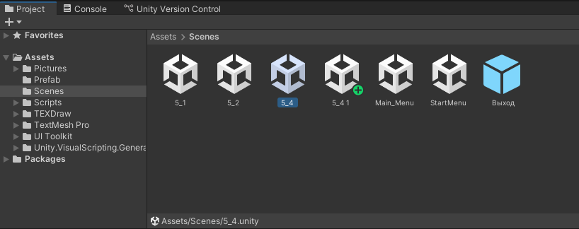

Аналогично проделываем с директорией скриптов `Scripts/5_4` и изображений `Pictures/5_4`, ведь для каждой задачи может быть свой уникальный набор скриптов и изображений.
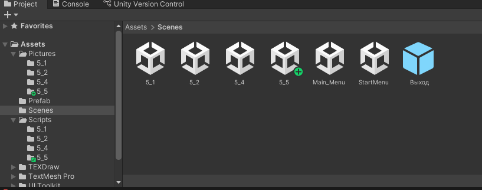


### Возможнные ошибки 

При этом, у вас может появиться ошибка ***Assets\Scripts\5_5\TS.cs(56,10): error CS0111: Type 'TS_5_4' already defines a member called 'Start' with the same parameter types***, которая говорит лишь о том, что класс с таким названием уже существует в глобальной области видимости. 
В этом случае следует перейти в файл, в котором происходит ошибка (например, TS.cs) и изменить индекс в названии класса на номер вашей новой задачи:
```c#
public class TS_5_5 : MonoBehaviour{ ...
```
Аналогичную процедуру следует проделать во всех дублированных скриптах при возникновении ошибки такого вида. 


### Зависимости

*Дальнейшее пояснение основано на задаче 5_4*
После загрузки всех необходимых скриптов и изображений, следует перейти в сцену вашей новой задачи и заменить скрипты на новые для вашей задачи в объектах:
- Canvas/UI/Reshenie/Проверка
- Canvas/Resh/Calculating
- Canvas/Resh/Calculating/Diagrams/PV Diagram
- Canvas/Resh/Calculating/Diagrams/TS Diagram

*названия диаграмм могут отличаться в зависимости от задачи*

Обновить обработчик событий у кнопок:
- Canvas/UI/Reshenie/Проверка
- Canvas/UI/Reshenie/Построить график

Обновить изображение с текстом задачи у объекта:
- Canvas/UI/Zadacha/TextZadachi

## Постановка задачи

В объекте `Canvas/Resh/Calculating` построчно расположены переменные, которые будут высчитываться в ходе задачи, а также пояснения к решению задачи. В конце поля решения расположены диаграммы. 

### ВАЖНО! ВСЕГДА СОБЛЮДАЙТЕ СТИЛЬ НАИМЕНОВАНИЙ ПЕРЕМЕННЫХ, А ТАКЖЕ СЛЕДИТЕ ЗА РЕГИСТРОМ И РАСКЛАДКОЙ КЛАВИАТУРЫ.

### Концепция 

`Canvas/Resh/Calculating/`:
- `Poyas (X)` - объект с текстом пояснения для решения задачи
- `Var_Str` - объект, содержащий строку решения одной переменной
    - `Var` - место под переменную, необходимая для расчетов искомой переменной
    - `inform` - часть строки, содержащая численные значения подставляемых переменных, структура повторяет структуру и названия переменных в  `Var_Str`
    - `Otvet` - объект, содержащий вычисленное значение искомой переменной и единицы измерения
    - `RAVNO (X)` - визуальное отображение знака равно без привязки к тексту
- `Diagrams` - объект, содержащий диаграммы

Каждая `Var` должна содержать ссылку на объект с таким же названием в объекта `inform` в поле `Informator`. Остальные поля устанавилваются автоматически при копировании объекта. 

Для каждой пары объектов `Var_Str` и `inform` задается одинаковая разметка в стиле [LaTex](https://www.overleaf.com/learn/latex/Spacing_in_math_mode#User-defined_binary_and_relational_operators) в компоненте **TEXDraw UI**.

`Canvas/Naity/vars` содержит перечень переменных, заданых обычным текстом в стиле [LaTex](https://www.overleaf.com/learn/latex/Spacing_in_math_mode#User-defined_binary_and_relational_operators)

`Canvas/Dano/vars`:

- `Dano(X)` - объект, содержащий информацию об одной заданной переменной
    - `InputField (TMP)` - объект, в котором задается начальное значение переменной в поле *Text* компонента **TextMeshPro - Input Field**
    - `Si` - объект с текстом единиц измерения
    - `Button (Legacy)` - интерактивный объект, необходимый для реализации [Drag-And-Drop](https://ru.wikipedia.org/wiki/Drag-and-drop) и ретрансляции значений из поля "Дано" в новые места поля "Решение"
    - `=`  - объект для визуализации знака "равно" в независимом от текста месте

## Проектирование

Для удобства проектирования задачи, удобнее всего скрыть из вида поле `Canvas/UI`:

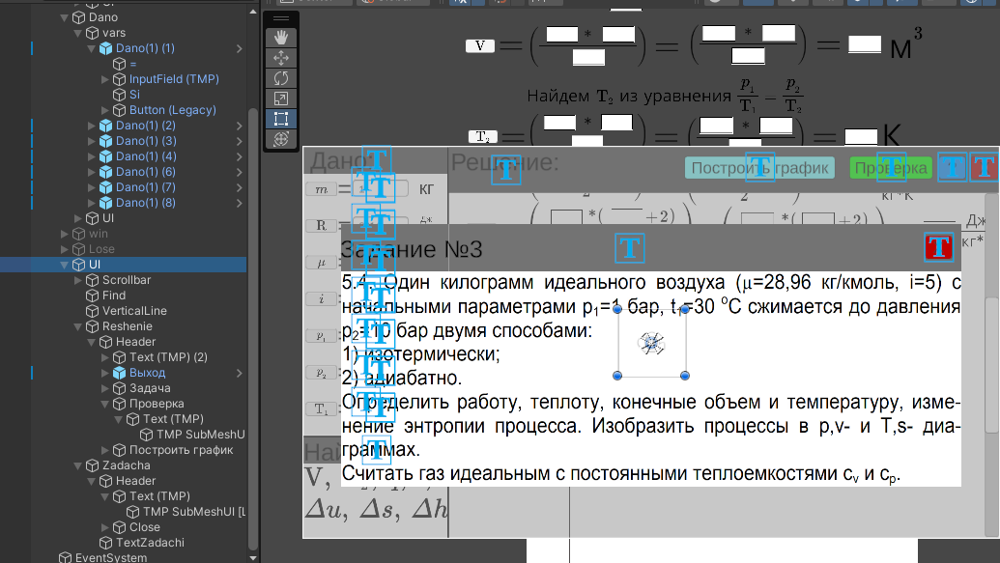

После чего откроется все поле "Решение", доступное для взаимодействия:
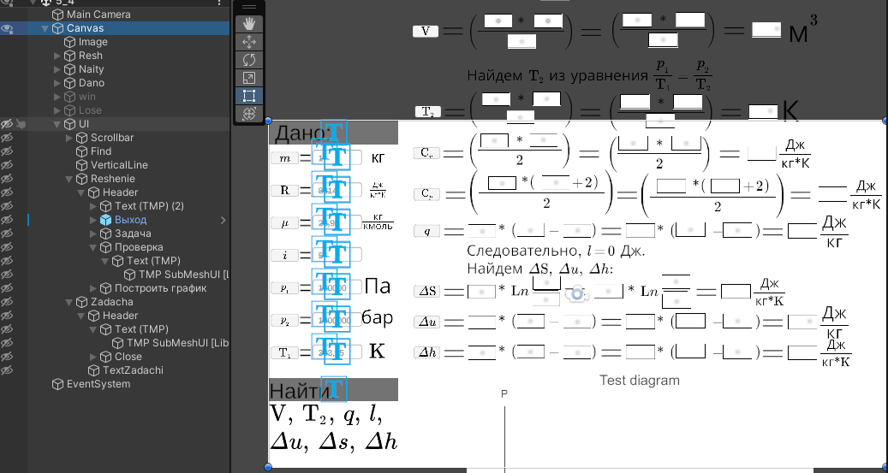

Редактируйте расположение объектов для переменных и для их численных представлений согласно вашему решению задачи. 
Объекты `Poyas (Х)` без текста можно использовать как разделители, так как у них можно без проблем настроить высоту, тем самым отдавлив соседие объекты в случае их наложения. 
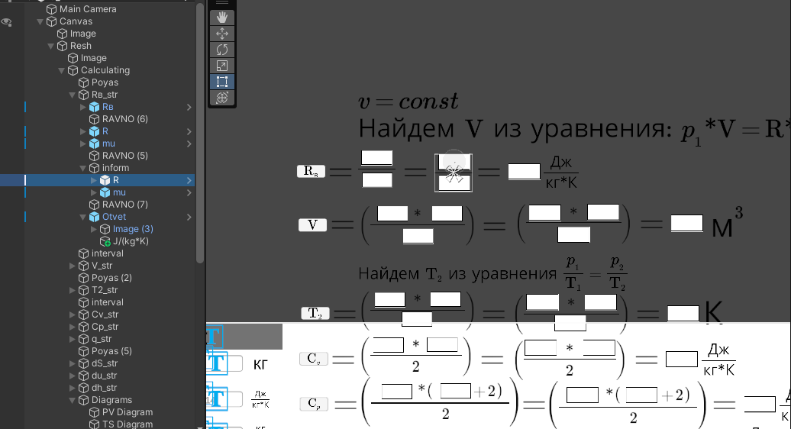


## Программирование

Разработано 2 основных программы для решения каждой задачи: `Check` и `Calc`, необходимые для проверки решения и его расчета соответственно. 

В скрипте `Calc` задаются все переменные, которые необходимо автоматически расчитывать в ходе решения задачи. Это переменные каждой из строк - они пересчитываются при каждом обновлении при перетаскивании переменных или изменений значений в поле "Дано". Эти переменные **не нужно** задавать в **Inspector**, так как они всегда являются дочерними объектами по отношению к объекту `Canvas/Resh/Calculating`. 
Поэтому они расчитываются в коде, при инициализации кода, то есть в функции *Start*:

```c#
    private void Start()
    {
        VStr = F(gameObject, "V_str");
        ...
        V = F(VStr, "V");
        ...
    }
```

А в функции *FixedUpdate* расчитываются переменные для соответствующих полей:
```c#
 private void FixedUpdate()
 {
    try
    {
        SetRes(V, F(VStr, "Otvet"),
            (ToF(F(VStr, "inform/Rв")) * ToF(F(VStr, "inform/T1"))) / ToF(F(VStr, "inform/p1"))
           );
    }
    catch { }
    ...
 }
```
Структура необходимо соблюдать и изменять в коде из примера требуется только: `V`, `VStr` заданные ранее и название переменных в ссылках на дочерние объекты `Rв`, `T1`, `p1`.

Для упрощения расчетов, в каждом скрипте `Calc` и `Check` рекомендуется оставлять комментарий с математическим представлением решения задачи, совпадающим с решением из проектирования:
```c#
    /**
      * MATH
      * 
      * Rв = R / mu
      * V = (Rв * T1) / p1
      * T2 = (p2 * T1) / p1
      *
      * Cv = Rв * i / 2
      * Cp = Rв * (i + 2) / 2
      * 
      * q = Cv * (T2 - T1)
      * 
      * dS = Cv * Ln(T2 / T1)
      * du = Cv * (T2 - T1) 
      * dh = Cp * (T2 - T1) 
      */
```


В скрипте `Check` задаются переменные **ТОЛЬКО** из поля "Дано" и ответы из поля "Решение" (Объекты `Otvet` искомых переменных). 

Также, рекомендуется помимо блока комментариев **MATH**, оставлять также комментарий **MATH Simpled**, в котором вся математическая логика упрощена до использования **ТОЛЬКО** переменных из блока "Дано". Пример для задачи 5_4:

```c#
/**
  * MATH simpled
  * 
  * V = (R / mu * T1) / p1
  * dS = ((R / mu) * i / 2) * Ln(((p2 * T1) / p1) / T1)
  * du = ((R / mu) * i / 2) * (((p2 * T1) / p1) - T1) 
  * dh = ((R / mu) * (i + 2) / 2) * (((p2 * T1) / p1) - T1) 
  * 
  */
```
Соответственно, изменять необходимо только вычисления результатов `calculatedResult` и проверку этого вычисления в переменной `win`.


PV- и TS-диаграммы уже настроены на стандартные формулы для расчета графика в каждой точке, исходя из условий задач. В зависимости от постановки задачи, вам могут быть даны не все переменные в поле "Дано", поэтому для переменных, которые не будут даны изначально, используется специальная функция `GetFloatFromBtn(V_btn)`. Для полей из блока "Дано" - `GetFloatFromDano(T1_dano)`. Для лучшей читаемости кода, рекомендуется подписывать названия переменных соответствующим индексом, который характеризует их происхождение. 

```c#
void GeneratePVGraph()
{
    ...
    // Получаем данные из UI
    T1 = GetFloatFromDano(T1_dano);
    T2 = GetFloatFromBtn(T2_btn);
    V = GetFloatFromBtn(V_btn);
    mu = GetFloatFromDano(mu_dano);
    Rv = GetFloatFromBtn(Rv_btn);
    ...
}
```


Также, код для задачи 5_4 прокомментирован и в случае создания новых типов графиков, их также можно будет настроить, аналогично приведенным в примере. 

Не забывайте добавлять себя в список создателей этого приложения на сцене `StartMenu`, если у вас действительно получилось разобраться и внедрить новую рабочую задачу в данную программу. 

# Сборка

Проект можно скомпилировать как для мобильных устройств, так и для компьютера. 
Также, в сцены `MainMenu` в списке задач, у кнопок, загружающих соответствующую сцену, указывается индекс сцены. Этот индекс - индекс всех сцен, который можно посмотреть и добавить в меню сборки проекта Unity (**"File/Build Settings"**)

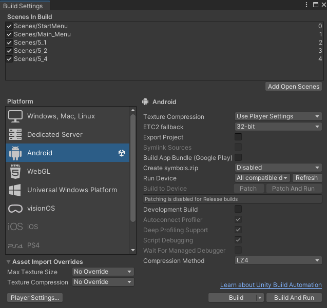